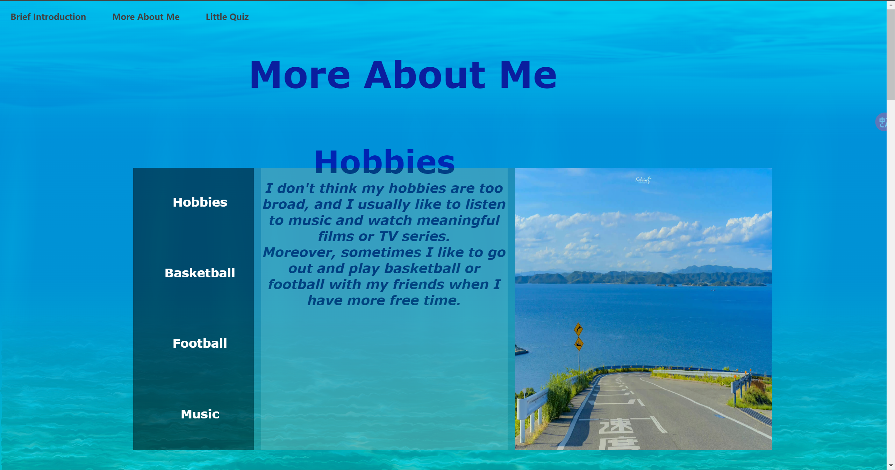

# WEB-Assignment

## Overview
The project is a web-based quiz application. The application asks users a series of questions, collects their answers, and provides feedback on the correctness of their answers. The quiz application was designed using **HTML**, **CSS**, **JavaScript**, and **Node.js** and utilises **Socket.IO** for real-time communication between the client and server.


## Global Configuration:
* **total.css**: Applies to **index.html**, **about.html** and **quiz.html** files in the project, , providing element style parameters for them, mainly controlling the parameters of the navigation bar component.
* **server.js**: It creates a simple real-time quiz application using Express and Socket.IO and stores the questions and the data of leaderboard. The server loads and sends questions to the client, and after the client submits an answer, the server validates the answer and returns the result.
* **BackgroundCSS/demo.css**, **BackgroundCSS/main.css**: These two css files provide parameters for beautifying the background, which is a template I found on the Internet. (Reference: https://www.bootstrapmb.com/item/14752)
* Navigation Bar Components: 
    * Related Files: **navbar.html**, **navbar.css**, **navbar.js**(empty)
    * It is fixed at the top of every page so that clients can navigate between pages easily. And I deployed the navigation bar to other pages using an iframe with the following code:
    ```html
    <iframe src="./components/navbar/navbar.html" title="Navigation Bar"></iframe>
## Introduction Page(root): 
* Path: https://staticchief-polkaduet-3000.codio-box.uk and https://staticchief-polkaduet-3000.codio-box.uk/index.html
* Related Files: **index.html**, **index.css**, **index.js**(empty)


This page provides a brief introduction about my study status and some areas of interest. And users can click the "More About Me" link to navigate to About Page to learn more about me. There is nothing in this interface that requires the use of js code for interaction, so the js file associated with it is empty.

## About Page: 
* Path: https://staticchief-polkaduet-3000.codio-box.uk/about.html
* Related Files: **about.html**, **about.css**, **about.js**


This page provides some detailed information about my several hobbies. So I created several containers which contain some description and relevant images to help users have a better understanding. And these containers all have a slideshow that automatically show mulitiple images. The implementation of this functionality requires the setting of js code function in **about.js**.

## Quiz Application Page: 
* Path: https://staticchief-polkaduet-3000.codio-box.uk/quiz.html
* Related Files: **quiz.html**, **quiz.css**, **quiz.js**, **server.js**


This page is a real-time interactive question and answer page. It operates as follows:
### Loading Questions:
The questions stored in **server.js** will be sent to the connected client. When the client connects to the server, it emits a **load questions** event to request the questions.
### Displaying Questions: 
After the user enters his or her name and click the "start" button, the client dynamically generates the first question and choice buttons and displays them to the user. 
### Submitting Answers: 
When a user selects an answer, the client sends the answer index along with the question index to the server. And users are given a 20-second time limit to do each question, and if they don't complete the question within the specified countdown, they will be judged as having done it wrong straight away.
### Receiving Feedback: 
The server checks the answer and sends back whether the answer is correct or incorrect. Returning results may take a little time. The client then displays appropriate feedback to the user. And the user can click the "Next Question" button to answer next question.
### Displaying Result:
After the user finishes all 10 questions in the quiz, his or her username, score and time consumed will be sent to the server and added into the leaderboard as a new record. And the leaderboard will also be sorted in the server. Finally, it will be sent to the client. Then the final result will be displayed, containing how many points they score and the time they consume in answering all the questions. What's more, there is a leaderboard which contains users' username, score and time they consume(the fastest user is given advantage if there is an equal number of correct answers). 
### Clearing Leaderboard:
If the website operator want to clear the leaderboard, he or she can go to edit **quiz.js** file, find the part of the checkAnswer function definition where the last line of code is commented out. Uncomment this line, and after doing the whole quiz once, re-comment it and run the website again. This line emits a **delete records** event to the server to set the leaderboard as a empty list.


## Challenges
### Real-time Communication
One of the primary challenges was implementing real-time communication between the client and server. This required a deep understanding of Socket.IO. And I need to have the flexibility to deploy it into a function in the client js file. It took a lot of tweaking to get it to work the way I wanted it to.

### Dynamic Content Rendering
Dynamically rendering questions and choices on the client side presented challenges related to the correct order of rendering and hiding different components. And it's time-consuming to find out the ideal layout of elements, especially there are many elements to coordinate. So it takes efforts and time to tweak the code in both css and js files.

### Error Handling
Since I didn't have a good knowledge of implementing Socket.IO, I encountered lots of errors about defining socket in the progress. However, after giving it plenty of tries, I eventually found out its mechanism.

### Functionalities Testing
I need to test the integrity of the application so that I have to do the quiz many times and simulate doing quiz in different scenarios. In this way, I found several bugs of my code and fixed them eventually.

## Client-Server Communication
The communication between the client and server is managed using Socket.IO, which enables real-time, bidirectional communication.

### Event Handling

* Server-side Events:

    * **load questions**: When the server connects to the client, it emits a **load questions** event to send the data of questions to the client.
    * **submit answer**: Upon receiving the **submit answer** event, the server checks the answer, determines if it is correct, and emits an **answer result** event with the result.
    * **answer result**: Emit an **answer result** event with the result of the answer.
    * **load leaderboard**: The server receives the data of a new record and add it to the leaderboard and sort the leaderboard.
    * **update leaderboard**: The server emits an **update leaderboard** event with the new sorted leaderboard.
    * **delete records**: The server receives the event and redifines the leaderboard as an empty list.

    ```javascript
    io.on('connection', (socket) => {

        socket.emit('load questions', questions);
        // sent questions to the quiz page

        // receive the answer from the quiz page
        socket.on('submit answer', (answer) => {
            const currentQuestion = answer.questionIndex;
            const index = answer.answer;
            // check the answer and sent the result back to the quiz page
            if (index === questions[currentQuestion].correct) {
                socket.emit('answer result', true);
            } else {
                socket.emit('answer result', false);
            }
        });

        socket.on('load leaderboard', (data) => {
            leaderboard.push(data);
            // receive the result from the quiz page
            // add the result to the leaderboard
            leaderboard.sort((a, b) => b.score - a.score || a.Time - b.Time);

            // sent the updated leaderboard back to the quiz page
            socket.emit('update leaderboard', leaderboard);
        });

        socket.on('delete records', () => {
            leaderboard = [];
            // clear the leaderboard

            socket.emit('update leaderboard', leaderboard);
            // sent the updated leaderboard back to the quiz page
        })

    });
* Client-side Events:

    * **load questions**: When the client connects to the server, it receives questions from the server.
    * **submit answer**: When a user selects an answer, the client emits a **submit answer** event with the answer index and question index.
    * **answer result**: Receive the result(true or false) from the server to determine whether add 1 point to score and render the result.
    * **load leaderboard**: After the user finishes answering the last question, the client emits a **load leaderboard** event to the server with the username, score and time consumed of the user. 
    * **update leaderboard**: The client receives the new leaderboard renders it.
    * **delete records**: The client emits a **delete records** event to the server in order to delete all records in the leaderboard.

    ```javascript
    document.addEventListener('DOMContentLoaded', () => {
    const socket = io();

    socket.on('load questions', (loadedQuestions) => {
        console.log('Received questions:', loadedQuestions);
        questions = loadedQuestions;
    });
    // receive the questions from the server

    });
    ```

    ```javascript
    const socket = io();

    // Send the answer to the server
    socket.emit('submit answer', { questionIndex: currentQuestion, answer: index });

    // Receive the result from the server
    socket.on('answer result', (result) => {
        document.getElementById('loading').style.display = 'none';
        if (result) {
            score++;
            document.getElementById('feedback').textContent = 'Your answer is correct!';
        } else {
            document.getElementById('feedback').textContent = 'Your answer is incorrect!';
        }
        if (currentQuestion + 1 < questions.length) {
            document.getElementById('next-button').style.display = 'block';
        } else {
            showResults();
        }
        if (currentQuestion + 1 === questions.length) {
            // if the last question is answered, sent the result to the server
            socket.emit('load leaderboard', { username: localStorage.getItem('currentUsername'), score: score, Time: Time });

            // Receive the updated leaderboard from the server
            socket.on("update leaderboard", (leaderboard) => {
                const leaderboardList = document.getElementById('leaderboard-list');
                leaderboardList.innerHTML = '';

                leaderboard.forEach((entry, index) => {
                    const tr = document.createElement('tr');
                    tr.innerHTML = `
                    <td>${index + 1}</td>
                    <td>${entry.username}</td>
                    <td>${entry.score} points</td>
                    <td>${entry.Time || 0} seconds</td>
                `;
                    leaderboardList.appendChild(tr);
                });

                document.getElementById('leaderboard').style.display = 'block';
            });

            // socket.emit('delete records');// Delete the records in the leaderboard
        }
    });
    ```
## Socket.IO Usage
Socket.IO is used for handling these events and ensuring smooth real-time updates. Here's a brief explanation of how it works:

1. Connection Establishment: When the client loads, it establishes a connection to the server using Socket.IO.
2. Event Emission: The client and server emit and listen for various events (**load questions**, **submit answer**, **answer result**, **load leaderboard**, **update leaderboard**, **delete records**) to exchange data.
3. Real-time Feedback: This setup allows the server to provide immediate feedback to the client without the need for page reloads, creating a seamless user experience.

## References
* CSS Background Template: https://www.bootstrapmb.com/item/14752
* Socket.IO Tutorial Documentation: https://socket.io/docs/v4/
* W3School Tutorial Documentation: https://www.w3school.com.cn/
